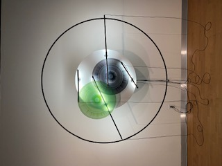
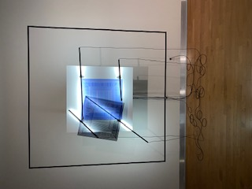
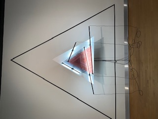
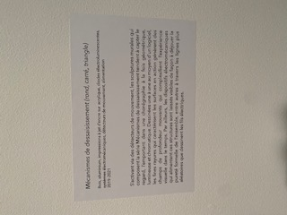
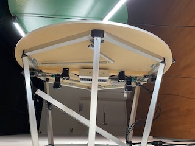
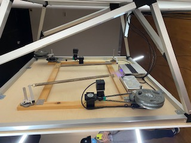

## 

* ### Béchard Hudon
* #### 2019-2021
* ####  Configuration du sensible
* #### Salle Alfred-Pellan
* #### Visité le 9 mars

### Cartel:

#### Les dispositifs sont accrochés sur le mur gauche de la pièce distancés d'environ deux mètres chacun. Plusieurs projecteur les illuminent de façon à faire ressortir le mécanisme. Des petites lumières sont placées sur le dos de l'oeuvre pour réaliser un effet visuel. Le branchement des oeuvres est à la fois cacher et visible. L'auteur tenait à faire resortir l'imperfection de ses oeuvres en montrant les cables de connections et le branchement au mur.

#### Ces oeuvres m'ont fait vivre une expérience de détente surtout à cause de son bruit de fonctionnement qui n'est pas si bruyant, donc il faut être assez silencieux pour l'écouter. J'ai bien aimé le mouvement ipnotisant que les dispositifs exécutent à cause de la forme créer par ceux-ci. Celui-ci fait en sorte que notre attention est rapidement capté par l'oeuvre. Si on se déplace lors de ce mouvement, il peut être différent dépendamment de notre position et de la vitesse à laquelle nous allons. Le meilleur geste à poser serait de rester stable et de regarder l'oeuvre en action. Le seul négatif que j'ai trouver à propos de ces oeuvres à été le bruit qui peut être aggaçant à la longue.
