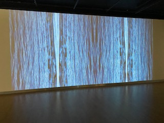
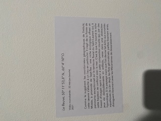
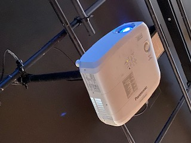

## Le Fleuve

* ### Béchard Hudon
* #### 2021
* #### Configuration du sensible
* #### Salle Alfred-Pellan
* #### Visité le 9 mars

### Cartel:

#### Cette oeuvre ma fait sentir détendu à cause de ressemblance flagrante à l'eau. C'était comme si on regardait un fleuve agité de proche. L'oeuvre est consistitué d'un projecteur et d'un écran blanc placé à une certaine distance l'un de l'autre. L'oeuvre est simple et complexe à la fois à cause des multiples façon qu'on peut les représentés. 

#### Cet écran bleu m'a fait sentir au bord d'un fleuve et m'a fait réfléchir. Il m'a fait sentir en paix avec moi-même. J'ai trouvé le concept génial, l'idée originale et l'intention derière intéressante. Pour cette oeuvre je n'ai pas de point négatifs vu que le seul élément manquant était le sons, mais l'intention de l'auteur, qui était que le sons des autres oeuvres était complémentaire à celle-ci, était si bien penser que je donne à cette oeuvre un 10/10.
