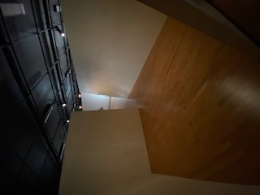
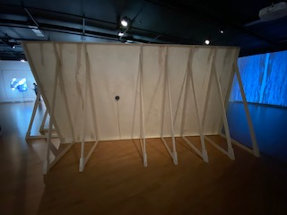
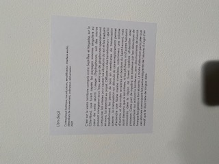
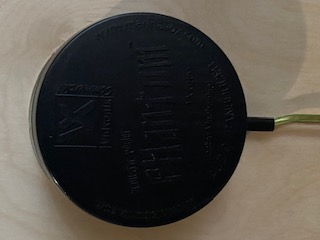
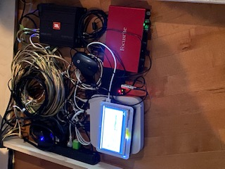

## L'en deçà

* ### Béchard Hudon
* #### 2021
* #### Configuration du sensible
* #### Salle Alfred-Pellan
* #### Visité le 9 mars

### Cartel:

#### Ce dispositif est un peu plus inabituel à cause de sa forme et de ses effets. Il est composés de deux murs inclinés vers l'extérieur placé en forme de carré incomplet fait ressentir un univers naturel remplie de bruit et de vibrations natureles. Un système de sons est placé sur l'extérieur de chacun des deux murs. Son branchement est très bien dissimulé à l'extérieur de la structure.

#### Personnelement j'ai détesté cet oeuvre pas à cause de son concept ou de sa forme, mais plutôt à cause des vibrations créé par les systèmes de sons collé aux murs. Ceux-ci m'ont vraiment dérangé et ne m'ont pas donner envie de rester dans cet environnement plus de 5 secondes. Les points positifs de l'oeuvre pour moi ont vraiment été l'esthétic. Le branchement bien dissimulé et simple, l'inclinaison des murs a aussi ajouté un plus et la forme en général était quelque chose d'intéressant. 
