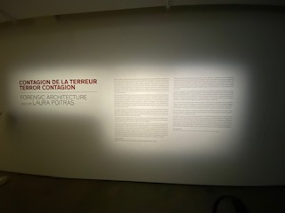

# La Contagion de la Terrreur (Présenté par: Steven René-Allard)

## Table des matières
* #### 1.Informations sur l'oeuvre
* #### 2.Description de l'oeuvre
* #### 3.Appréciation de la visite

## Informations
* #### Forensic Architecture/MAC
* #### 2022
* #### Musée d'Arts Contemporain de Montréal
* #### 1er mars 2022
* #### Petit/métro

# Description 

## Entré: 
* #### Grand/Espacé 
* #### Petit bureau de réception (gauche de la pièce)
* #### 

. 

## Source: 
* #### Image_entre: https://uploads.agoramtl.com/original/3X/2/1/2179f9d2ff0647e1b5a715726ac1965ee8d26f90.jpeg
