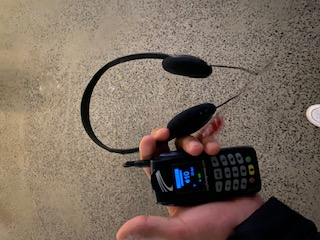
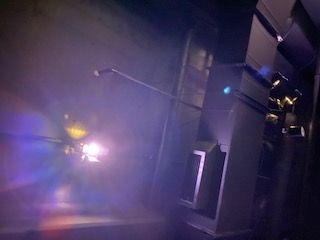
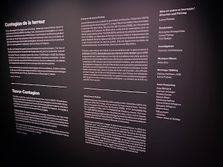
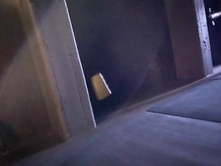
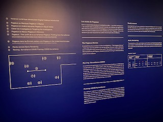
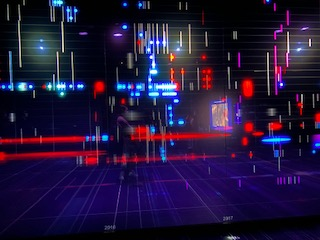
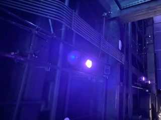
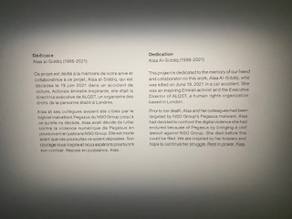
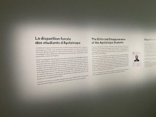
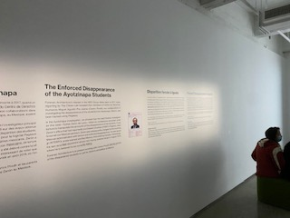

# La Contagion de la Terrreur (Présenté par: Steven René-Allard)

## Table des matières
* #### 1.Informations sur l'oeuvre
* #### 2.Description de l'oeuvre
* #### 3.Appréciation de la visite

## Informations
* #### Forensic Architecture/MAC
* #### 2022
* #### Musée d'Arts Contemporain de Montréal
* #### 1er mars 2022
* #### Petit/métro/marche

# Description 
### Entré (pas d'image): 
* #### Grand/Espacé 
* #### Petit bureau de réception (à droite de la pièce)
* #### Instruction/équipement

### Salle 1:
* #### Noir
* #### Forme rectangulaire
* #### Écran (taille presque complète du mur du fond)
* #### Système de sons 
* #### Divan

* #### Éclairage
* #### Cartel

### Salle 2:
* #### Éclairage bleu
* #### Forme carré
* #### Chemin
* #### Écrans accrochés au plafond

* #### Cartel
* #### Détecttion automatisé (casque et moniteur inclus)
* #### Mur de séparation
* #### Éclairage

### Pause vidéo:
. 

### Salle 3:

* #### Relié à l'entré
* #### Écran (taille presque complète du mur du fond)
* #### Divan

* #### Cartels

## Critique et justification
* #### Exposition 1: 8.3/10
  * ##### Bien structuré
* #### Exposition 2: 7.2/10
  * ##### Concept original
  * ##### Bruit de connection orible pour l'ouie
* #### Exposition 3: 5.5/10
  * ##### Répétitif et enuyeux

## Source: 
* #### Image_entre: https://uploads.agoramtl.com/original/3X/2/1/2179f9d2ff0647e1b5a715726ac1965ee8d26f90.jpeg
* #### Image_salle_1: https://macm.org/app/uploads/2021/10/Forensic_salle_B_32.jpg
* #### Image_salle_2: https://macm.org/app/uploads/2021/10/Forensic_salle_C_48-1903x1200-1.jpg
* #### Image_salle_3: https://content.forensic-architecture.org/wp-content/uploads/2021/11/Forensic_salle_A_11-1600x970.jpg
